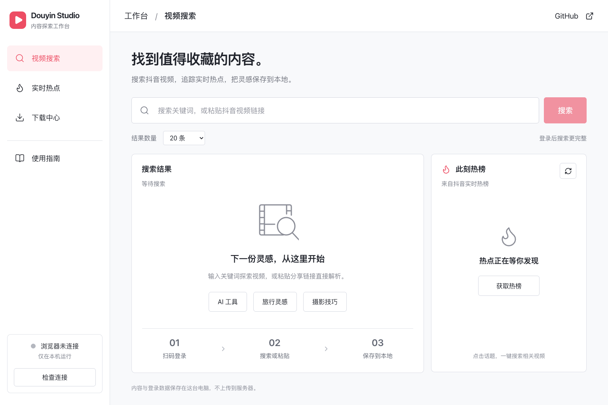

# Douyin Studio

本地运行的抖音内容探索工作台：**搜索视频 → 发现热点 → 选择下载 → 本地预览**。

React + TypeScript + Express + Playwright。界面和后台在自己的电脑运行，不需要第三方解析服务、付费 API、Java 或 Python。



> 上图为生产构建的真实界面（初始空状态，无模拟结果）。设计参考、运行验证与手机截图见 [QA 文档](docs/verification.md)。

## 功能

- **视频搜索**：关键词、视频 ID、详情 URL，或含短链接的整段分享文案；10 / 20 / 30 / 50 条目标数量。
- **实时热点**：读取抖音实际返回的热榜，显示获取时间；点击话题搜索相关视频。
- **结果管理**：真实封面、标题、作者、时长、点赞数；单条/批量下载，JSON 导出。
- **下载中心**：串行任务队列，真实字节进度、取消、失败重试、重复任务合并、日志和历史记录。
- **本地预览**：浏览器内播放完整下载的 MP4，或另存到浏览器下载目录。
- **账号连接**：扫码登录专用浏览器，或连接已有的本地自动化 Chrome；不需要在网页中填写 Cookie。
- **响应式界面**：桌面双栏、手机单栏，键盘导航、弹窗焦点管理和减少动画支持。

不是抖音官方产品。只保存当前登录会话在网页中能够播放并提供直接媒体地址的内容；不绕过登录、验证码、付费或 DRM，不移除水印。仅下载你拥有权利或获授权保存的作品。

## 快速开始

### 环境

- Node.js **22.12+**，建议 Node.js 22 LTS。
- Chrome 或 Playwright Chromium。
- macOS / Windows / Linux 的图形桌面环境。默认会打开真实浏览器供扫码。

```bash
git clone https://github.com/CyberMemoir/douyin-studio.git
cd douyin-studio
npm ci

# macOS 已安装 Google Chrome 时会自动使用它。
# 其他环境或没有 Chrome 时安装 Playwright Chromium：
npx playwright install chromium

npm run build
npm start
```

打开 **http://127.0.0.1:4321**。

macOS 也可以双击仓库中的 **`start.command`**：自动安装缺失的 npm 依赖、构建并打开本地网页（前提是已安装 Node.js）。

### 第一次使用

1. 点击左下角 **检查连接**，在弹窗中选择 **打开扫码登录**。
2. 在弹出的专用 Chrome 中登录抖音，然后回到网页点击 **检查连接**。
3. 输入关键词搜索，或粘贴视频分享链接。
4. 勾选结果，点击 **下载所选**；在下载中心查看进度、预览或保存文件。
5. 点击 **实时热点 → 刷新热榜**，获取当前热点并搜索相关作品。

登录 Cookie 存在仅表示“可能已登录”；搜索和下载是否可用，以页面实际返回结果为准。登录窗口与工作台窗口是分开的。

## 配置

默认无需配置。可复制 `.env.example` 为 `.env`：

| 变量                  | 默认值          | 用途                                                    |
| --------------------- | --------------- | ------------------------------------------------------- |
| `PORT`                | `4321`          | 本地服务端口，仅绑定 `127.0.0.1`                        |
| `DOUYIN_CDP_URL`      | 空              | 连接已有专用自动化 Chrome，例如 `http://127.0.0.1:9421` |
| `DOUYIN_PROFILE_DIR`  | `.data/browser` | 自己管理的专用浏览器目录；不要使用日常 Chrome 配置      |
| `DOUYIN_BROWSER_PATH` | 自动选择        | 指定 Chrome / Chromium 可执行文件                       |
| `DOUYIN_DATA_DIR`     | `.data`         | 下载、元数据和任务记录根目录                            |

### 复用已有自动化登录

如果已经有一个专用 Chrome 在本机 CDP 端口运行，在 `.env` 中设置：

```dotenv
DOUYIN_CDP_URL=http://127.0.0.1:9421
```

此模式连接现有浏览器，不复制 Cookie，不上传浏览器配置。停止 Studio 只会断开连接，不会关闭外部 Chrome。

只允许本机 HTTP CDP 地址。没有该浏览器时，请先启动原自动化工具，或删除这一行，让 Studio 使用自己的专用浏览器。

### 本地数据

```text
.data/
├── browser/         # 专用浏览器配置（不使用外部 CDP 时）
├── state.json       # 任务、视频元数据、缓存热榜
└── downloads/       # 完整的 MP4 文件
```

下载先写入 `.part`，验证 MP4 文件头、完成传输后才转为 `.mp4`。取消/失败会清理当前临时文件；应用重启后未完成任务标记为中断，不伪装为成功。没有实现断点续传。

`.env*`（保留 `.env.example`）、`.data/`、`node_modules/`、日志和构建产物均在 `.gitignore` 中。自定义数据目录也必须自行加入忽略规则。不要向 GitHub 提交真实会话、下载文件或缓存元数据。

## 开发与测试

```bash
npm run dev     # Express + Vite，同一端口，热更新
npm run check   # TypeScript 类型检查
npm test        # 离线单元/API 测试，无需登录账号
npm run build   # 类型检查 + 前端生产构建
npm start       # 启动生产模式，需要先 build
```

可选真实端到端测试（会搜索并下载一条真实视频；需要本地服务和已登录的自动化浏览器）：

```bash
# 使用已安装的 Playwright Chromium
node scripts/ui-smoke.mjs --live

# 使用系统 Chrome
QA_CHANNEL=chrome node scripts/ui-smoke.mjs --live
```

`STUDIO_URL` 可修改服务地址，`QA_OUTPUT` 可指定截图输出目录。CI 只运行离线测试和构建，不连接任何账号。

## 架构

```text
src/                 React 界面、API 状态、共享组件
shared/types.ts       前后端共同数据模型
server/
  browser.ts         专用浏览器生命周期、正常页面搜索/热点/详情
  normalize.ts       网站响应 → 规范化视频与热榜
  jobs.ts            串行任务、取消、日志
  download.ts        媒体域名校验、流式下载、MP4 校验
  store.ts           本地原子持久化
  app.ts             JSON API、SSE、下载与预览
  index.ts           本地服务入口
```

网站自己完成其请求和会话处理，后台读取正常浏览器页面收到的内容响应，必要时使用 DOM 回退。没有内置私有签名算法，也没有依赖不存在的采集子项目。网页变化时主要调整 `browser.ts` / `normalize.ts`。

详细接口见 [API 文档](docs/api.md)，本机访问保护见 [SECURITY.md](SECURITY.md)。

## 当前范围

- 支持可直接读取的 MP4。图文、直播、DRM、加密/分段媒体、评论采集、发布、私信和定时任务不在第一版范围内。
- 搜索结果数量是上限，不是保证；平台可能限流、要求验证或不返回完整数据。
- 热榜是“最近一次实际获取”，不会自行编造热点；需要点击刷新。
- 单个下载上限 2 GB、10 分钟；媒体地址过期时尝试重新解析一次。
- 不开放公网访问，不作为 GitHub Pages 纯静态站运行。公开仓库提供源码；自动化依赖本地服务及浏览器。
- 封面与视频通过抖音及其 CDN 获取。页面不能获取媒体源时会显示失败原因，不假报成功。

## License

[MIT](LICENSE)。本项目代码独立实现，没有打包其他采集仓库、第三方账号数据或视频素材。npm 依赖保留各自许可证。
